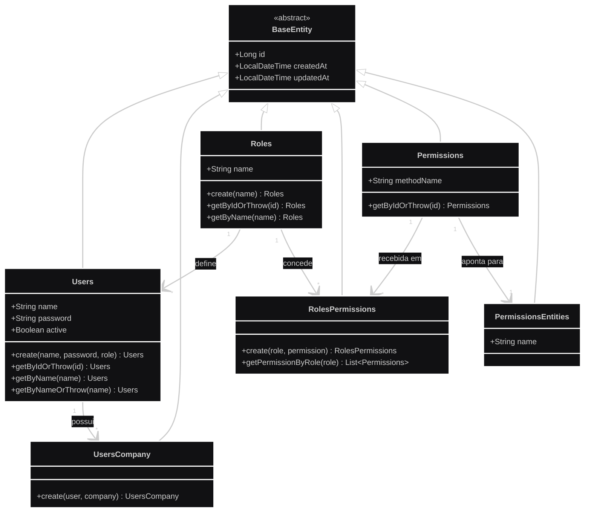

```mermaid-next
%%{init: {'theme': 'redux-dark-color'}}%%
classDiagram
    class BaseEntity {
        <<abstract>>
        +Long id
        +LocalDateTime createdAt
        +LocalDateTime updatedAt
    }

    class Users {
        +String name
        +String password
        +Boolean active
        +create(name, password, role) Users
        +getByIdOrThrow(id) Users
        +getByName(name) Users
        +getByNameOrThrow(name) Users
    }

    class UsersCompany {
        +create(user, company) UsersCompany
    }

    class Roles {
        +String name
        +create(name) Roles
        +getByIdOrThrow(id) Roles
        +getByName(name) Roles
    }

    class RolesPermissions {
        +create(role, permission) RolesPermissions
        +getPermissionByRole(role) List~Permissions~
    }

    class Permissions {
        +String methodName
        +getByIdOrThrow(id) Permissions
    }

    class PermissionsEntities {
        +String name
    }

    BaseEntity <|-- Users
    BaseEntity <|-- UsersCompany
    BaseEntity <|-- Roles
    BaseEntity <|-- RolesPermissions
    BaseEntity <|-- Permissions
    BaseEntity <|-- PermissionsEntities

    Users "1" --> "*" UsersCompany : possui
    Roles "1" --> "*" Users : define
    Roles "1" --> "*" RolesPermissions : concede
    Permissions "1" --> "*" RolesPermissions : recebida em
    Permissions "1" --> "1" PermissionsEntities : aponta para
```