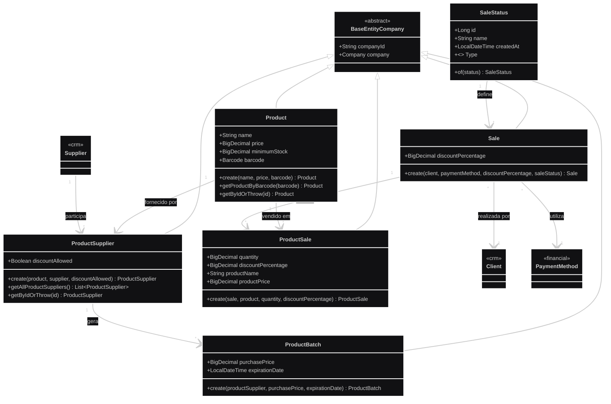

```mermaid-next
%%{init: {'theme': 'redux-dark-color'}}%%
classDiagram
    class BaseEntityCompany {
        <<abstract>>
        +String companyId
        +Company company
    }

    class Product {
        +String name
        +BigDecimal price
        +BigDecimal minimumStock
        +Barcode barcode
        +create(name, price, barcode) Product
        +getProductByBarcode(barcode) Product
        +getByIdOrThrow(id) Product
    }

    class ProductSupplier {
        +Boolean discountAllowed
        +create(product, supplier, discountAllowed) ProductSupplier
        +getAllProductSuppliers() List~ProductSupplier~
        +getByIdOrThrow(id) ProductSupplier
    }

    class ProductBatch {
        +BigDecimal purchasePrice
        +LocalDateTime expirationDate
        +create(productSupplier, purchasePrice, expirationDate) ProductBatch
    }

    class Sale {
        +BigDecimal discountPercentage
        +create(client, paymentMethod, discountPercentage, saleStatus) Sale
    }

    class ProductSale {
        +BigDecimal quantity
        +BigDecimal discountPercentage
        +String productName
        +BigDecimal productPrice
        +create(sale, product, quantity, discountPercentage) ProductSale
    }

    class SaleStatus {
        +Long id
        +String name
        +LocalDateTime createdAt
        +<<enum>> Type
        +of(status) SaleStatus
    }

    class Supplier {
        <<crm>>
    }

    class Client {
        <<crm>>
    }

    class PaymentMethod {
        <<financial>>
    }

    BaseEntityCompany <|-- Product
    BaseEntityCompany <|-- ProductSupplier
    BaseEntityCompany <|-- ProductBatch
    BaseEntityCompany <|-- Sale
    BaseEntityCompany <|-- ProductSale

    Product "1" --> "*" ProductSupplier : fornecido por
    Supplier "1" --> "*" ProductSupplier : participa
    ProductSupplier "1" --> "*" ProductBatch : gera
    Product "1" --> "*" ProductSale : vendido em
    Sale "1" --> "*" ProductSale : contém
    Sale "*" --> "1" Client : realizada por
    Sale "*" --> "1" PaymentMethod : utiliza
    SaleStatus "1" --> "*" Sale : define
```