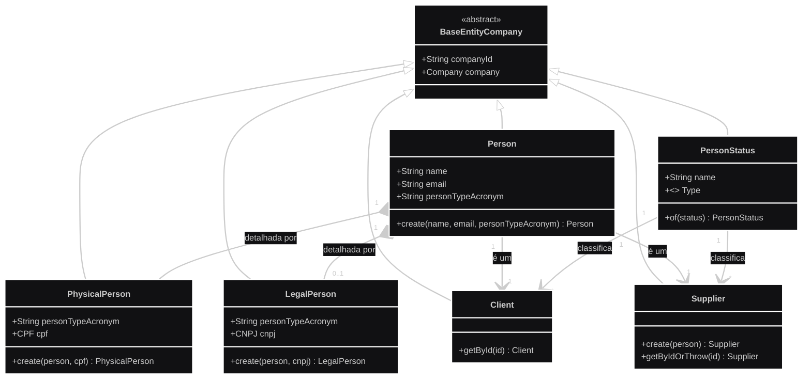

```mermaid-next
%%{init: {'theme': 'redux-dark-color'}}%%
classDiagram
    class BaseEntityCompany {
        <<abstract>>
        +String companyId
        +Company company
    }

    class Person {
        +String name
        +String email
        +String personTypeAcronym
        +create(name, email, personTypeAcronym) Person
    }

    class PhysicalPerson {
        +String personTypeAcronym
        +CPF cpf
        +create(person, cpf) PhysicalPerson
    }

    class LegalPerson {
        +String personTypeAcronym
        +CNPJ cnpj
        +create(person, cnpj) LegalPerson
    }

    class Client {
        +getById(id) Client
    }

    class Supplier {
        +create(person) Supplier
        +getByIdOrThrow(id) Supplier
    }

    class PersonStatus {
        +String name
        +<<enum>> Type
        +of(status) PersonStatus
    }

    BaseEntityCompany <|-- Person
    BaseEntityCompany <|-- PhysicalPerson
    BaseEntityCompany <|-- LegalPerson
    BaseEntityCompany <|-- Client
    BaseEntityCompany <|-- Supplier
    BaseEntityCompany <|-- PersonStatus

    Person "1" *-- "0..1" PhysicalPerson : detalhada por
    Person "1" *-- "0..1" LegalPerson : detalhada por
    Person "1" --> "1" Client : é um
    Person "1" --> "1" Supplier : é um
    PersonStatus "1" --> "*" Client : classifica
    PersonStatus "1" --> "*" Supplier : classifica
```