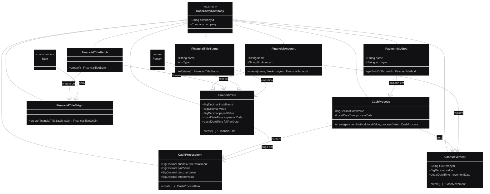

```mermaid-next
%%{init: {'theme': 'redux-dark-color'}}%%
classDiagram
    class BaseEntityCompany {
        <<abstract>>
        +String companyId
        +Company company
    }

    class FinancialAccount {
        +String name
        +String fluxAcronym
        +create(name, fluxAcronym) FinancialAccount
    }

    class PaymentMethod {
        +String name
        +String acronym
        +getByIdOrThrow(id) PaymentMethod
    }

    class FinancialTitleBatch {
        +create() FinancialTitleBatch
    }

    class FinancialTitle {
        +BigDecimal installment
        +BigDecimal value
        +BigDecimal payedValue
        +LocalDateTime expirationDate
        +LocalDateTime fullPayDate
        +create(...) FinancialTitle
    }

    class FinancialTitleOrigin {
        +create(financialTitleBatch, sale) FinancialTitleOrigin
    }

    class FinancialTitleStatus {
        +String name
        +<<enum>> Type
        +of(status) FinancialTitleStatus
    }

    class CashProcess {
        +BigDecimal totalValue
        +LocalDateTime processDate
        +create(paymentMethod, totalValue, processDate) CashProcess
    }

    class CashProcessItem {
        +BigDecimal financialTitleInstallment
        +BigDecimal paidValue
        +BigDecimal discountValue
        +BigDecimal interestValue
        +create(...) CashProcessItem
    }

    class CashMovement {
        +String fluxAcronym
        +BigDecimal value
        +LocalDateTime movementDate
        +create(...) CashMovement
    }

    class Person {
        <<crm>>
    }

    class Sale {
        <<commercial>>
    }

    BaseEntityCompany <|-- FinancialAccount
    BaseEntityCompany <|-- PaymentMethod
    BaseEntityCompany <|-- FinancialTitleBatch
    BaseEntityCompany <|-- FinancialTitle
    BaseEntityCompany <|-- FinancialTitleOrigin
    BaseEntityCompany <|-- FinancialTitleStatus
    BaseEntityCompany <|-- CashProcess
    BaseEntityCompany <|-- CashProcessItem
    BaseEntityCompany <|-- CashMovement

    FinancialAccount "1" --> "*" FinancialTitle : recebe
    FinancialTitleBatch "1" --> "*" FinancialTitle : agrupa
    Person "1" --> "*" FinancialTitle : responsável por
    FinancialTitleStatus "1" --> "*" FinancialTitle : classifica
    FinancialTitleBatch "1" --> "*" FinancialTitleOrigin : origem de
    Sale "1" --> "*" FinancialTitleOrigin : gera
    PaymentMethod "1" --> "*" CashProcess : utilizado em
    CashProcess "1" --> "*" CashProcessItem : contém
    FinancialTitle "1" --> "*" CashProcessItem : pago em
    CashProcess "1" --> "*" CashMovement : gera
    FinancialAccount "1" --> "*" CashMovement : registra
```