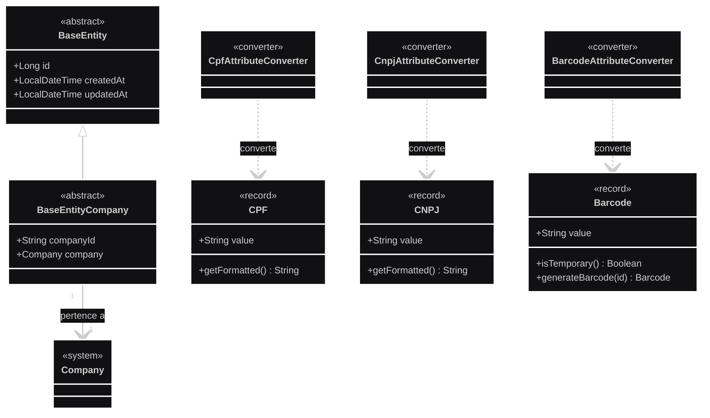

```mermaid-next
%%{init: {'theme': 'redux-dark-color'}}%%
classDiagram
    class BaseEntity {
        <<abstract>>
        +Long id
        +LocalDateTime createdAt
        +LocalDateTime updatedAt
    }

    class BaseEntityCompany {
        <<abstract>>
        +String companyId
        +Company company
    }

    class CPF {
        <<record>>
        +String value
        +getFormatted() String
    }

    class CNPJ {
        <<record>>
        +String value
        +getFormatted() String
    }

    class Barcode {
        <<record>>
        +String value
        +isTemporary() Boolean
        +generateBarcode(id) Barcode
    }

    class CpfAttributeConverter {
        <<converter>>
    }

    class CnpjAttributeConverter {
        <<converter>>
    }

    class BarcodeAttributeConverter {
        <<converter>>
    }

    class Company {
        <<system>>
    }

    BaseEntity <|-- BaseEntityCompany

    BaseEntityCompany "1" --> "1" Company : pertence a

    CpfAttributeConverter ..> CPF : converte
    CnpjAttributeConverter ..> CNPJ : converte
    BarcodeAttributeConverter ..> Barcode : converte
```