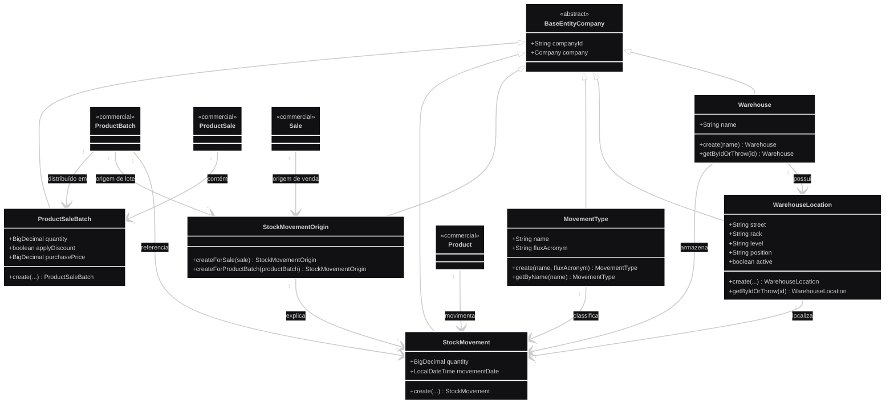

```mermaid-next
%%{init: {'theme': 'redux-dark-color'}}%%
classDiagram
    class BaseEntityCompany {
        <<abstract>>
        +String companyId
        +Company company
    }

    class Warehouse {
        +String name
        +create(name) Warehouse
        +getByIdOrThrow(id) Warehouse
    }

    class WarehouseLocation {
        +String street
        +String rack
        +String level
        +String position
        +boolean active
        +create(...) WarehouseLocation
        +getByIdOrThrow(id) WarehouseLocation
    }

    class MovementType {
        +String name
        +String fluxAcronym
        +create(name, fluxAcronym) MovementType
        +getByName(name) MovementType
    }

    class StockMovementOrigin {
        +createForSale(sale) StockMovementOrigin
        +createForProductBatch(productBatch) StockMovementOrigin
    }

    class StockMovement {
        +BigDecimal quantity
        +LocalDateTime movementDate
        +create(...) StockMovement
    }

    class ProductSaleBatch {
        +BigDecimal quantity
        +boolean applyDiscount
        +BigDecimal purchasePrice
        +create(...) ProductSaleBatch
    }

    class Product {
        <<commercial>>
    }

    class ProductBatch {
        <<commercial>>
    }

    class ProductSale {
        <<commercial>>
    }

    class Sale {
        <<commercial>>
    }

    BaseEntityCompany <|-- Warehouse
    BaseEntityCompany <|-- WarehouseLocation
    BaseEntityCompany <|-- MovementType
    BaseEntityCompany <|-- StockMovementOrigin
    BaseEntityCompany <|-- StockMovement
    BaseEntityCompany <|-- ProductSaleBatch

    Warehouse "1" --> "*" WarehouseLocation : possui
    MovementType "1" --> "*" StockMovement : classifica
    Product "1" --> "*" StockMovement : movimenta
    Warehouse "1" --> "*" StockMovement : armazena
    WarehouseLocation "1" --> "*" StockMovement : localiza
    StockMovementOrigin "1" --> "*" StockMovement : explica
    ProductBatch "1" --> "*" StockMovement : referencia
    Sale "1" --> "*" StockMovementOrigin : origem de venda
    ProductBatch "1" --> "*" StockMovementOrigin : origem de lote
    ProductSale "1" --> "*" ProductSaleBatch : contém
    ProductBatch "1" --> "*" ProductSaleBatch : distribuído em
```