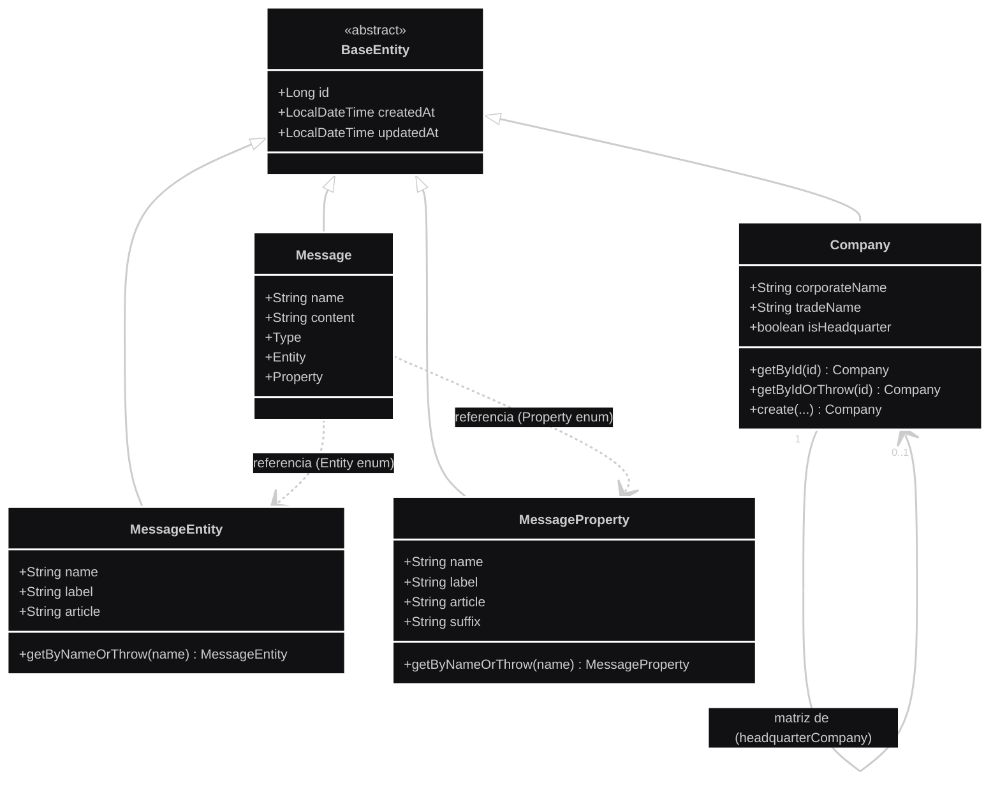

# Diagrama de Classes - domínio `system`

```mermaid-next
%%{init: {'theme': 'redux-dark-color'}}%%
classDiagram
    class BaseEntity {
        <<abstract>>
        +Long id
        +LocalDateTime createdAt
        +LocalDateTime updatedAt
    }

    class Company {
        +String corporateName
        +String tradeName
        +boolean isHeadquarter
        +getById(id) Company
        +getByIdOrThrow(id) Company
        +create(...) Company
    }

    class Message {
        +String name
        +String content
        +Type
        +Entity
        +Property
    }

    class MessageEntity {
        +String name
        +String label
        +String article
        +getByNameOrThrow(name) MessageEntity
    }

    class MessageProperty {
        +String name
        +String label
        +String article
        +String suffix
        +getByNameOrThrow(name) MessageProperty
    }

    BaseEntity <|-- Company
    BaseEntity <|-- Message
    BaseEntity <|-- MessageEntity
    BaseEntity <|-- MessageProperty

    Company "1" --> "0..1" Company : matriz de (headquarterCompany)
    Message ..> MessageEntity : referencia (Entity enum)
    Message ..> MessageProperty : referencia (Property enum)
```