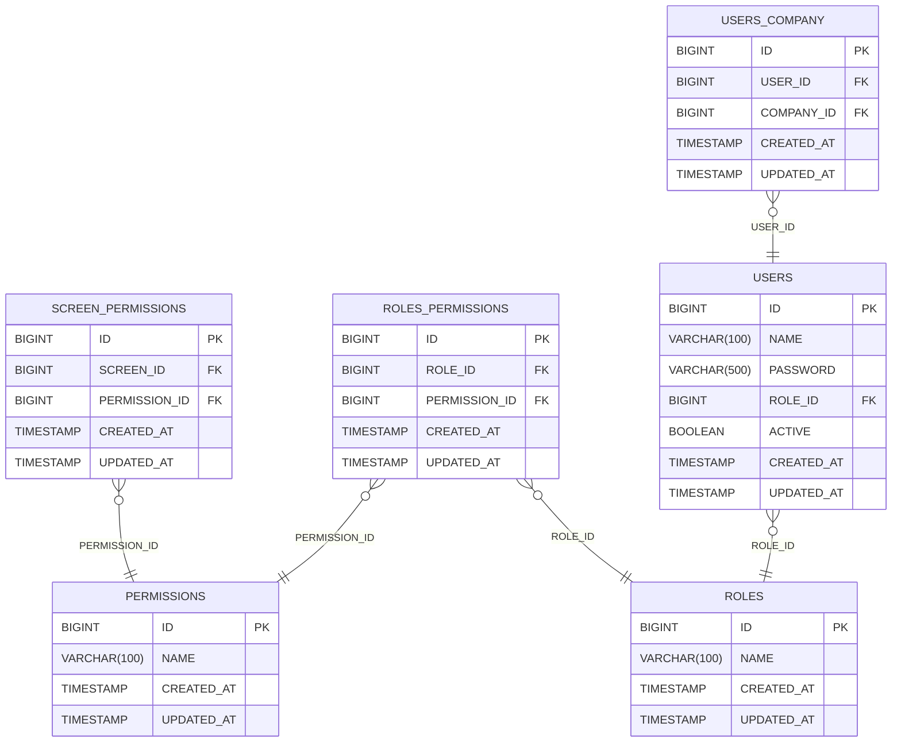

```mermaid-next
erDiagram
    PERMISSIONS {
        BIGINT ID PK
        VARCHAR(100) NAME
        TIMESTAMP CREATED_AT
        TIMESTAMP UPDATED_AT
    }

    SCREEN_PERMISSIONS {
        BIGINT ID PK
        BIGINT SCREEN_ID FK
        BIGINT PERMISSION_ID FK
        TIMESTAMP CREATED_AT
        TIMESTAMP UPDATED_AT
    }

    ROLES {
        BIGINT ID PK
        VARCHAR(100) NAME
        TIMESTAMP CREATED_AT
        TIMESTAMP UPDATED_AT
    }

    ROLES_PERMISSIONS {
        BIGINT ID PK
        BIGINT ROLE_ID FK
        BIGINT PERMISSION_ID FK
        TIMESTAMP CREATED_AT
        TIMESTAMP UPDATED_AT
    }

    USERS {
        BIGINT ID PK
        VARCHAR(100) NAME
        VARCHAR(500) PASSWORD
        BIGINT ROLE_ID FK
        BOOLEAN ACTIVE
        TIMESTAMP CREATED_AT
        TIMESTAMP UPDATED_AT
    }

    USERS_COMPANY {
        BIGINT ID PK
        BIGINT USER_ID FK
        BIGINT COMPANY_ID FK
        TIMESTAMP CREATED_AT
        TIMESTAMP UPDATED_AT
    }

    SCREEN_PERMISSIONS }O--|| PERMISSIONS : "PERMISSION_ID"
    ROLES_PERMISSIONS }O--|| ROLES : "ROLE_ID"
    ROLES_PERMISSIONS }O--|| PERMISSIONS : "PERMISSION_ID"
    USERS }O--|| ROLES : "ROLE_ID"
    USERS_COMPANY }O--|| USERS : "USER_ID"
```