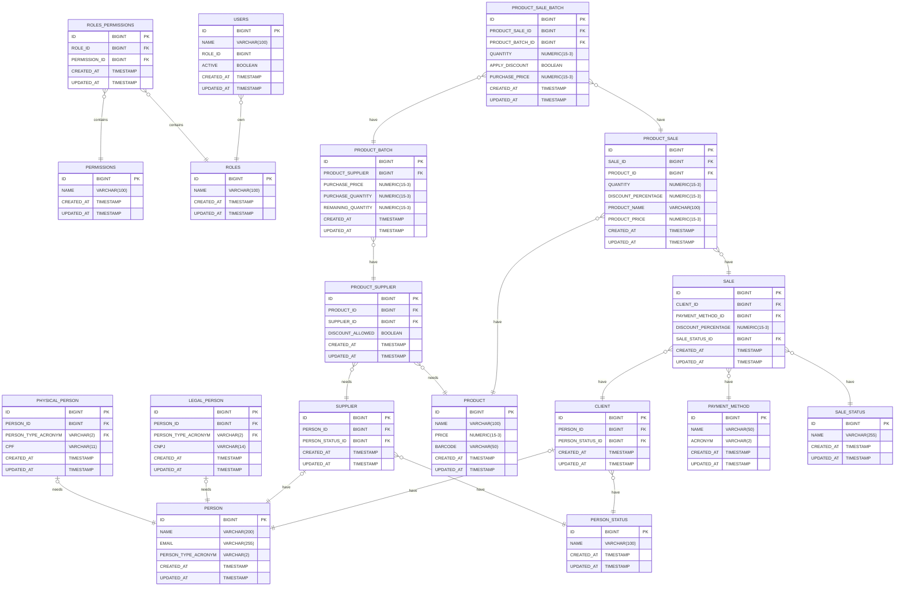

```mermaid
erDiagram
	%% AUTHENTICATION
	PERMISSIONS {
		ID BIGINT PK
		NAME VARCHAR(100)
		CREATED_AT TIMESTAMP
		UPDATED_AT TIMESTAMP
	}
	
	ROLES {
		ID BIGINT PK
		NAME VARCHAR(100)
		CREATED_AT TIMESTAMP
		UPDATED_AT TIMESTAMP
	}
	
	ROLES_PERMISSIONS {
		ID BIGINT PK
		ROLE_ID BIGINT FK
		PERMISSION_ID BIGINT FK
		CREATED_AT TIMESTAMP
		UPDATED_AT TIMESTAMP
	}
	
	ROLES_PERMISSIONS }o--|| ROLES : contains
	ROLES_PERMISSIONS }o--|| PERMISSIONS : contains
	
	USERS {
		ID BIGINT PK
		NAME VARCHAR(100)
		ROLE_ID BIGINT
		ACTIVE BOOLEAN
		CREATED_AT TIMESTAMP
		UPDATED_AT TIMESTAMP
	}
	
	USERS }o--|| ROLES : own
	
	
	%% ENTERPRISE RESOURCE PLANNING
	PERSON {
		ID BIGINT PK
		NAME VARCHAR(200)
		EMAIL VARCHAR(255)
		PERSON_TYPE_ACRONYM VARCHAR(2)
		CREATED_AT TIMESTAMP
		UPDATED_AT TIMESTAMP
	}
	
	PHYSICAL_PERSON {
		ID BIGINT PK
		PERSON_ID BIGINT FK
		PERSON_TYPE_ACRONYM VARCHAR(2) FK
		CPF VARCHAR(11)
		CREATED_AT TIMESTAMP
		UPDATED_AT TIMESTAMP
	}
	
	PHYSICAL_PERSON |o--|| PERSON : needs
	
	LEGAL_PERSON {
		ID BIGINT PK
		PERSON_ID BIGINT FK
		PERSON_TYPE_ACRONYM VARCHAR(2) FK
		CNPJ VARCHAR(14)
		CREATED_AT TIMESTAMP
		UPDATED_AT TIMESTAMP
	}
	
	LEGAL_PERSON |o--|| PERSON : needs
	
	PERSON_STATUS {
		ID BIGINT PK
		NAME VARCHAR(100)
		CREATED_AT TIMESTAMP
		UPDATED_AT TIMESTAMP
	}
	
	SUPPLIER {
		ID BIGINT PK
		PERSON_ID BIGINT FK
		PERSON_STATUS_ID BIGINT FK
		CREATED_AT TIMESTAMP
		UPDATED_AT TIMESTAMP
	}
	
	SUPPLIER |o--|| PERSON : have
	SUPPLIER }o--|| PERSON_STATUS : have
	
	PRODUCT {
		ID BIGINT PK
		NAME VARCHAR(100)
		PRICE NUMERIC(15-3)
		BARCODE VARCHAR(50)
		CREATED_AT TIMESTAMP
		UPDATED_AT TIMESTAMP
	}
	
	PRODUCT_SUPPLIER {
		ID BIGINT PK
		PRODUCT_ID BIGINT FK
		SUPPLIER_ID BIGINT FK
		DISCOUNT_ALLOWED BOOLEAN
		CREATED_AT TIMESTAMP
		UPDATED_AT TIMESTAMP
	}
	
	PRODUCT_SUPPLIER }o--|| PRODUCT : needs
	PRODUCT_SUPPLIER }o--|| SUPPLIER : needs
	
	PRODUCT_BATCH {
		ID BIGINT PK
		PRODUCT_SUPPLIER BIGINT FK
		PURCHASE_PRICE NUMERIC(15-3)
		PURCHASE_QUANTITY NUMERIC(15-3)
		REMAINING_QUANTITY NUMERIC(15-3)
		CREATED_AT TIMESTAMP
		UPDATED_AT TIMESTAMP
	}
	
	PRODUCT_BATCH }o--|| PRODUCT_SUPPLIER : have
	
	CLIENT {
		ID BIGINT PK
		PERSON_ID BIGINT FK
		PERSON_STATUS_ID BIGINT FK
		CREATED_AT TIMESTAMP
		UPDATED_AT TIMESTAMP
	}
	
	CLIENT |o--|| PERSON : have
	CLIENT }o--|| PERSON_STATUS : have
	
	PAYMENT_METHOD {
		ID BIGINT PK
		NAME VARCHAR(50)
		ACRONYM VARCHAR(2)
		CREATED_AT TIMESTAMP
		UPDATED_AT TIMESTAMP
	}
	
	SALE_STATUS {
		ID BIGINT PK
		NAME VARCHAR(255)
		CREATED_AT TIMESTAMP
		UPDATED_AT TIMESTAMP
	}
	
	SALE {
		ID BIGINT PK
		CLIENT_ID BIGINT FK
		PAYMENT_METHOD_ID BIGINT FK
		DISCOUNT_PERCENTAGE NUMERIC(15-3)
		SALE_STATUS_ID BIGINT FK
		CREATED_AT TIMESTAMP
		UPDATED_AT TIMESTAMP
	}
	
	SALE }o--|| CLIENT : have
	SALE }o--|| PAYMENT_METHOD : have
	SALE }o--|| SALE_STATUS : have
	
	PRODUCT_SALE {
		ID BIGINT PK
		SALE_ID BIGINT FK
		PRODUCT_ID BIGINT FK
		QUANTITY NUMERIC(15-3)
		DISCOUNT_PERCENTAGE NUMERIC(15-3)
		PRODUCT_NAME VARCHAR(100)
		PRODUCT_PRICE NUMERIC(15-3)
		CREATED_AT TIMESTAMP
		UPDATED_AT TIMESTAMP
	}
	
	PRODUCT_SALE }o--|| SALE : have
	PRODUCT_SALE }o--|| PRODUCT : have
	
	PRODUCT_SALE_BATCH {
		ID BIGINT PK
		PRODUCT_SALE_ID BIGINT FK
		PRODUCT_BATCH_ID BIGINT FK
		QUANTITY NUMERIC(15-3)
		APPLY_DISCOUNT BOOLEAN
		PURCHASE_PRICE NUMERIC(15-3)
		CREATED_AT TIMESTAMP
		UPDATED_AT TIMESTAMP
	}
	
	PRODUCT_SALE_BATCH }o--|| PRODUCT_SALE : have
	PRODUCT_SALE_BATCH }o--|| PRODUCT_BATCH : have
```