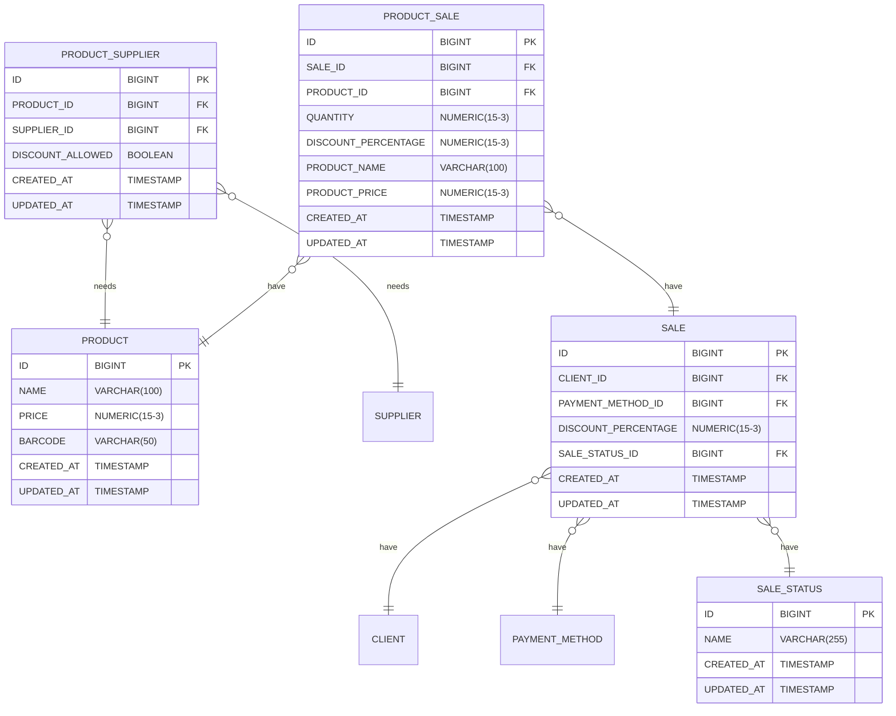

```mermaid-next
erDiagram
	PRODUCT {
		ID BIGINT PK
		NAME VARCHAR(100)
		PRICE NUMERIC(15-3)
		BARCODE VARCHAR(50)
		CREATED_AT TIMESTAMP
		UPDATED_AT TIMESTAMP
	}
	
	PRODUCT_SUPPLIER {
		ID BIGINT PK
		PRODUCT_ID BIGINT FK
		SUPPLIER_ID BIGINT FK
		DISCOUNT_ALLOWED BOOLEAN
		CREATED_AT TIMESTAMP
		UPDATED_AT TIMESTAMP
	}
	
	PRODUCT_SUPPLIER }o--|| PRODUCT : needs
	PRODUCT_SUPPLIER }o--|| SUPPLIER : needs
	
	SALE_STATUS {
		ID BIGINT PK
		NAME VARCHAR(255)
		CREATED_AT TIMESTAMP
		UPDATED_AT TIMESTAMP
	}
	
	SALE {
		ID BIGINT PK
		CLIENT_ID BIGINT FK
		PAYMENT_METHOD_ID BIGINT FK
		DISCOUNT_PERCENTAGE NUMERIC(15-3)
		SALE_STATUS_ID BIGINT FK
		CREATED_AT TIMESTAMP
		UPDATED_AT TIMESTAMP
	}
	
	SALE }o--|| CLIENT : have
	SALE }o--|| PAYMENT_METHOD : have
	SALE }o--|| SALE_STATUS : have
	
	PRODUCT_SALE {
		ID BIGINT PK
		SALE_ID BIGINT FK
		PRODUCT_ID BIGINT FK
		QUANTITY NUMERIC(15-3)
		DISCOUNT_PERCENTAGE NUMERIC(15-3)
		PRODUCT_NAME VARCHAR(100)
		PRODUCT_PRICE NUMERIC(15-3)
		CREATED_AT TIMESTAMP
		UPDATED_AT TIMESTAMP
	}
	
	PRODUCT_SALE }o--|| SALE : have
	PRODUCT_SALE }o--|| PRODUCT : have
```