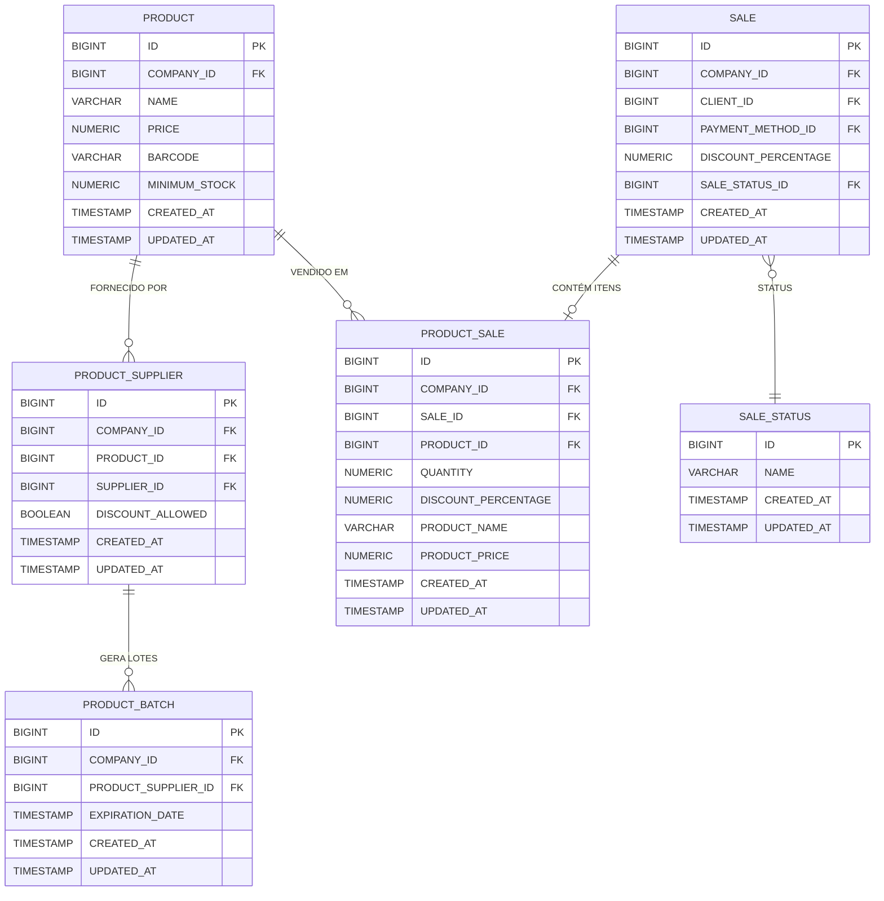

```mermaid-next
erDiagram
    PRODUCT {
        BIGINT ID PK
        BIGINT COMPANY_ID FK
        VARCHAR NAME
        NUMERIC PRICE
        VARCHAR BARCODE
        NUMERIC MINIMUM_STOCK
        TIMESTAMP CREATED_AT
        TIMESTAMP UPDATED_AT
    }
    PRODUCT_SUPPLIER {
        BIGINT ID PK
        BIGINT COMPANY_ID FK
        BIGINT PRODUCT_ID FK
        BIGINT SUPPLIER_ID FK
        BOOLEAN DISCOUNT_ALLOWED
        TIMESTAMP CREATED_AT
        TIMESTAMP UPDATED_AT
    }
    PRODUCT_BATCH {
        BIGINT ID PK
        BIGINT COMPANY_ID FK
        BIGINT PRODUCT_SUPPLIER_ID FK
        TIMESTAMP EXPIRATION_DATE
        TIMESTAMP CREATED_AT
        TIMESTAMP UPDATED_AT
    }
    SALE_STATUS {
        BIGINT ID PK
        VARCHAR NAME
        TIMESTAMP CREATED_AT
        TIMESTAMP UPDATED_AT
    }
    SALE {
        BIGINT ID PK
        BIGINT COMPANY_ID FK
        BIGINT CLIENT_ID FK
        BIGINT PAYMENT_METHOD_ID FK
        NUMERIC DISCOUNT_PERCENTAGE
        BIGINT SALE_STATUS_ID FK
        TIMESTAMP CREATED_AT
        TIMESTAMP UPDATED_AT
    }
    PRODUCT_SALE {
        BIGINT ID PK
        BIGINT COMPANY_ID FK
        BIGINT SALE_ID FK
        BIGINT PRODUCT_ID FK
        NUMERIC QUANTITY
        NUMERIC DISCOUNT_PERCENTAGE
        VARCHAR PRODUCT_NAME
        NUMERIC PRODUCT_PRICE
        TIMESTAMP CREATED_AT
        TIMESTAMP UPDATED_AT
    }

    PRODUCT ||--O{ PRODUCT_SUPPLIER : "FORNECIDO POR"
    PRODUCT_SUPPLIER ||--O{ PRODUCT_BATCH : "GERA LOTES"
    SALE ||--O| PRODUCT_SALE : "CONTÉM ITENS"
    PRODUCT ||--O{ PRODUCT_SALE : "VENDIDO EM"
    SALE }O--|| SALE_STATUS : "STATUS"
```