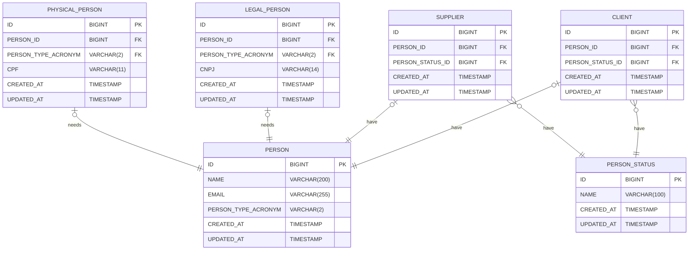

```mermaid-next
erDiagram

	PERSON {
		ID BIGINT PK
		NAME VARCHAR(200)
		EMAIL VARCHAR(255)
		PERSON_TYPE_ACRONYM VARCHAR(2)
		CREATED_AT TIMESTAMP
		UPDATED_AT TIMESTAMP
	}
	
	PHYSICAL_PERSON {
		ID BIGINT PK
		PERSON_ID BIGINT FK
		PERSON_TYPE_ACRONYM VARCHAR(2) FK
		CPF VARCHAR(11)
		CREATED_AT TIMESTAMP
		UPDATED_AT TIMESTAMP
	}
	
	PHYSICAL_PERSON |o--|| PERSON : needs
	
	LEGAL_PERSON {
		ID BIGINT PK
		PERSON_ID BIGINT FK
		PERSON_TYPE_ACRONYM VARCHAR(2) FK
		CNPJ VARCHAR(14)
		CREATED_AT TIMESTAMP
		UPDATED_AT TIMESTAMP
	}
	
	LEGAL_PERSON |o--|| PERSON : needs
	
	PERSON_STATUS {
		ID BIGINT PK
		NAME VARCHAR(100)
		CREATED_AT TIMESTAMP
		UPDATED_AT TIMESTAMP
	}
	
	SUPPLIER {
		ID BIGINT PK
		PERSON_ID BIGINT FK
		PERSON_STATUS_ID BIGINT FK
		CREATED_AT TIMESTAMP
		UPDATED_AT TIMESTAMP
	}
	
	SUPPLIER |o--|| PERSON : have
	SUPPLIER }o--|| PERSON_STATUS : have
	
	CLIENT {
		ID BIGINT PK
		PERSON_ID BIGINT FK
		PERSON_STATUS_ID BIGINT FK
		CREATED_AT TIMESTAMP
		UPDATED_AT TIMESTAMP
	}
	
	CLIENT |o--|| PERSON : have
	CLIENT }o--|| PERSON_STATUS : have
```