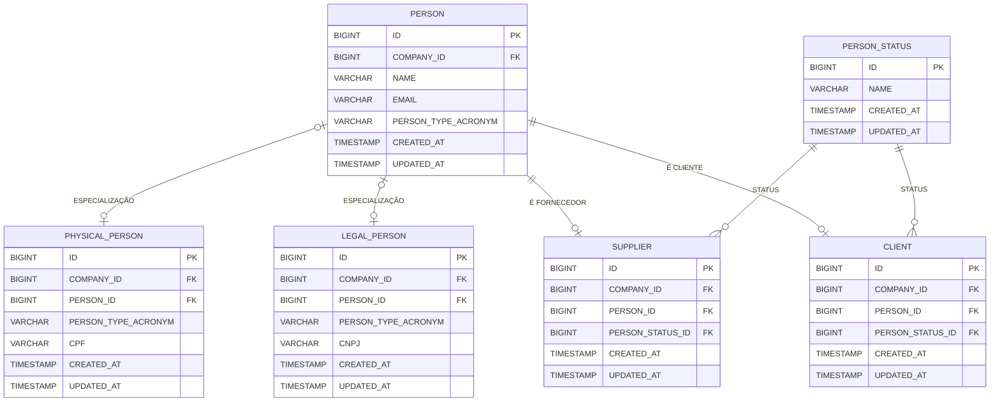

```mermaid-next
erDiagram
PERSON {
        BIGINT ID PK
        BIGINT COMPANY_ID FK
        VARCHAR NAME
        VARCHAR EMAIL
        VARCHAR PERSON_TYPE_ACRONYM
        TIMESTAMP CREATED_AT
        TIMESTAMP UPDATED_AT
    }
    PHYSICAL_PERSON {
        BIGINT ID PK
        BIGINT COMPANY_ID FK
        BIGINT PERSON_ID FK
        VARCHAR PERSON_TYPE_ACRONYM
        VARCHAR CPF
        TIMESTAMP CREATED_AT
        TIMESTAMP UPDATED_AT
    }
    LEGAL_PERSON {
        BIGINT ID PK
        BIGINT COMPANY_ID FK
        BIGINT PERSON_ID FK
        VARCHAR PERSON_TYPE_ACRONYM
        VARCHAR CNPJ
        TIMESTAMP CREATED_AT
        TIMESTAMP UPDATED_AT
    }
    PERSON_STATUS {
        BIGINT ID PK
        VARCHAR NAME
        TIMESTAMP CREATED_AT
        TIMESTAMP UPDATED_AT
    }
    SUPPLIER {
        BIGINT ID PK
        BIGINT COMPANY_ID FK
        BIGINT PERSON_ID FK
        BIGINT PERSON_STATUS_ID FK
        TIMESTAMP CREATED_AT
        TIMESTAMP UPDATED_AT
    }
    CLIENT {
        BIGINT ID PK
        BIGINT COMPANY_ID FK
        BIGINT PERSON_ID FK
        BIGINT PERSON_STATUS_ID FK
        TIMESTAMP CREATED_AT
        TIMESTAMP UPDATED_AT
    }

    PERSON |O--O| PHYSICAL_PERSON : "ESPECIALIZAÇÃO"
    PERSON |O--O| LEGAL_PERSON : "ESPECIALIZAÇÃO"
    PERSON ||--O| SUPPLIER : "É FORNECEDOR"
    PERSON ||--O| CLIENT : "É CLIENTE"
    PERSON_STATUS ||--O{ SUPPLIER : "STATUS"
    PERSON_STATUS ||--O{ CLIENT : "STATUS"
```