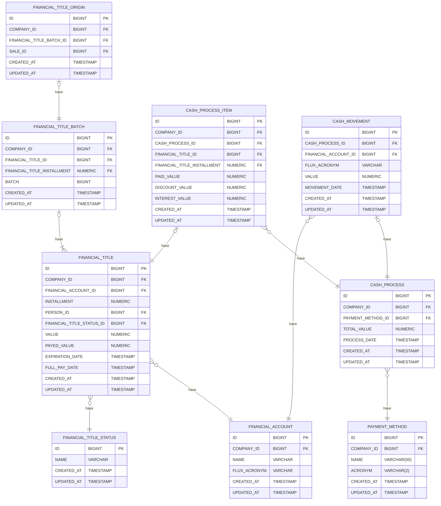

```mermaid-next
erDiagram
	
	PAYMENT_METHOD {
		ID BIGINT PK
		COMPANY_ID BIGINT FK
		NAME VARCHAR(50)
		ACRONYM VARCHAR(2)
		CREATED_AT TIMESTAMP
		UPDATED_AT TIMESTAMP
	}
	
	FINANCIAL_ACCOUNT {
		ID BIGINT PK
		COMPANY_ID BIGINT FK
		NAME VARCHAR
		FLUX_ACRONYM VARCHAR
		CREATED_AT TIMESTAMP
		UPDATED_AT TIMESTAMP
	}
	
	FINANCIAL_TITLE_STATUS {
		ID BIGINT PK
		NAME VARCHAR
		CREATED_AT TIMESTAMP
		UPDATED_AT TIMESTAMP
	}
	
	FINANCIAL_TITLE {
		ID BIGINT PK
		COMPANY_ID BIGINT FK
		FINANCIAL_ACCOUNT_ID BIGINT FK
		INSTALLMENT NUMERIC
		PERSON_ID BIGINT FK
		FINANCIAL_TITLE_STATUS_ID BIGINT FK
		VALUE NUMERIC
		PAYED_VALUE NUMERIC
		EXPIRATION_DATE TIMESTAMP
		FULL_PAY_DATE TIMESTAMP
		CREATED_AT TIMESTAMP
		UPDATED_AT TIMESTAMP
	}
	
	FINANCIAL_TITLE }o--|| FINANCIAL_ACCOUNT : have
	FINANCIAL_TITLE }o--|| FINANCIAL_TITLE_STATUS : have
	
	FINANCIAL_TITLE_BATCH {
		ID BIGINT PK
		COMPANY_ID BIGINT FK
		FINANCIAL_TITLE_ID BIGINT FK
		FINANCIAL_TITLE_INSTALLMENT NUMERIC FK
		BATCH BIGINT
		CREATED_AT TIMESTAMP
		UPDATED_AT TIMESTAMP 
	}
	
	FINANCIAL_TITLE_BATCH |o--|{ FINANCIAL_TITLE : have
	
	FINANCIAL_TITLE_ORIGIN {
		ID BIGINT PK
		COMPANY_ID BIGINT FK
		FINANCIAL_TITLE_BATCH_ID BIGINT FK
		SALE_ID BIGINT FK
		CREATED_AT TIMESTAMP
		UPDATED_AT TIMESTAMP
	}
	
	FINANCIAL_TITLE_ORIGIN |o--|| FINANCIAL_TITLE_BATCH : have
	
	CASH_PROCESS {
		ID BIGINT PK
		COMPANY_ID BIGINT FK
		PAYMENT_METHOD_ID BIGINT FK
		TOTAL_VALUE NUMERIC
		PROCESS_DATE TIMESTAMP
		CREATED_AT TIMESTAMP
		UPDATED_AT TIMESTAMP
	}
	
	CASH_PROCESS }o--|| PAYMENT_METHOD : have
	
	CASH_PROCESS_ITEM {
		ID BIGINT PK
		COMPANY_ID BIGINT FK
		CASH_PROCESS_ID BIGINT FK
		FINANCIAL_TITLE_ID BIGINT FK
		FINANCIAL_TITLE_INSTALLMENT NUMERIC FK
		PAID_VALUE NUMERIC
		DISCOUNT_VALUE NUMERIC
		INTEREST_VALUE NUMERIC
		CREATED_AT TIMESTAMP
		UPDATED_AT TIMESTAMP
	}
	
	CASH_PROCESS_ITEM }o--|| CASH_PROCESS : have
	CASH_PROCESS_ITEM |o--|| FINANCIAL_TITLE : have
	
	CASH_MOVEMENT {
		ID BIGINT PK
		CASH_PROCESS_ID BIGINT FK
		FINANCIAL_ACCOUNT_ID BIGINT FK
		FLUX_ACRONYM VARCHAR
		VALUE NUMERIC
		MOVEMENT_DATE TIMESTAMP
		CREATED_AT TIMESTAMP
		UPDATED_AT TIMESTAMP
	}
	
	CASH_MOVEMENT |o--|| CASH_PROCESS : have
	CASH_MOVEMENT }o--|| FINANCIAL_ACCOUNT : have
```