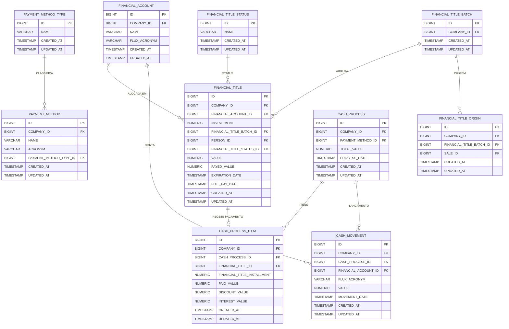

```mermaid-next
erDiagram
	PAYMENT_METHOD_TYPE {
        BIGINT ID PK
        VARCHAR NAME
        TIMESTAMP CREATED_AT
        TIMESTAMP UPDATED_AT
    }
    PAYMENT_METHOD {
        BIGINT ID PK
        BIGINT COMPANY_ID FK
        VARCHAR NAME
        VARCHAR ACRONYM
        BIGINT PAYMENT_METHOD_TYPE_ID FK
        TIMESTAMP CREATED_AT
        TIMESTAMP UPDATED_AT
    }
    FINANCIAL_ACCOUNT {
        BIGINT ID PK
        BIGINT COMPANY_ID FK
        VARCHAR NAME
        VARCHAR FLUX_ACRONYM
        TIMESTAMP CREATED_AT
        TIMESTAMP UPDATED_AT
    }
    FINANCIAL_TITLE_STATUS {
        BIGINT ID PK
        VARCHAR NAME
        TIMESTAMP CREATED_AT
        TIMESTAMP UPDATED_AT
    }
    FINANCIAL_TITLE_BATCH {
        BIGINT ID PK
        BIGINT COMPANY_ID FK
        TIMESTAMP CREATED_AT
        TIMESTAMP UPDATED_AT
    }
    FINANCIAL_TITLE {
        BIGINT ID PK
        BIGINT COMPANY_ID FK
        BIGINT FINANCIAL_ACCOUNT_ID FK
        NUMERIC INSTALLMENT
        BIGINT FINANCIAL_TITLE_BATCH_ID FK
        BIGINT PERSON_ID FK
        BIGINT FINANCIAL_TITLE_STATUS_ID FK
        NUMERIC VALUE
        NUMERIC PAYED_VALUE
        TIMESTAMP EXPIRATION_DATE
        TIMESTAMP FULL_PAY_DATE
        TIMESTAMP CREATED_AT
        TIMESTAMP UPDATED_AT
    }
    FINANCIAL_TITLE_ORIGIN {
        BIGINT ID PK
        BIGINT COMPANY_ID FK
        BIGINT FINANCIAL_TITLE_BATCH_ID FK
        BIGINT SALE_ID FK
        TIMESTAMP CREATED_AT
        TIMESTAMP UPDATED_AT
    }
    CASH_PROCESS {
        BIGINT ID PK
        BIGINT COMPANY_ID FK
        BIGINT PAYMENT_METHOD_ID FK
        NUMERIC TOTAL_VALUE
        TIMESTAMP PROCESS_DATE
        TIMESTAMP CREATED_AT
        TIMESTAMP UPDATED_AT
    }
    CASH_PROCESS_ITEM {
        BIGINT ID PK
        BIGINT COMPANY_ID FK
        BIGINT CASH_PROCESS_ID FK
        BIGINT FINANCIAL_TITLE_ID FK
        NUMERIC FINANCIAL_TITLE_INSTALLMENT
        NUMERIC PAID_VALUE
        NUMERIC DISCOUNT_VALUE
        NUMERIC INTEREST_VALUE
        TIMESTAMP CREATED_AT
        TIMESTAMP UPDATED_AT
    }
    CASH_MOVEMENT {
        BIGINT ID PK
        BIGINT COMPANY_ID FK
        BIGINT CASH_PROCESS_ID FK
        BIGINT FINANCIAL_ACCOUNT_ID FK
        VARCHAR FLUX_ACRONYM
        NUMERIC VALUE
        TIMESTAMP MOVEMENT_DATE
        TIMESTAMP CREATED_AT
        TIMESTAMP UPDATED_AT
    }

    PAYMENT_METHOD_TYPE ||--O{ PAYMENT_METHOD : "CLASSIFICA"
    FINANCIAL_ACCOUNT ||--O{ FINANCIAL_TITLE : "ALOCADA EM"
    FINANCIAL_TITLE_BATCH ||--O{ FINANCIAL_TITLE : "AGRUPA"
    FINANCIAL_TITLE_BATCH ||--O{ FINANCIAL_TITLE_ORIGIN : "ORIGEM"
    FINANCIAL_TITLE_STATUS ||--O{ FINANCIAL_TITLE : "STATUS"
    FINANCIAL_TITLE ||--O| CASH_PROCESS_ITEM : "RECEBE PAGAMENTO"
    CASH_PROCESS ||--O{ CASH_PROCESS_ITEM : "ITENS"
    CASH_PROCESS ||--O{ CASH_MOVEMENT : "LANÇAMENTO"
    FINANCIAL_ACCOUNT ||--O{ CASH_MOVEMENT : "CONTA"
```