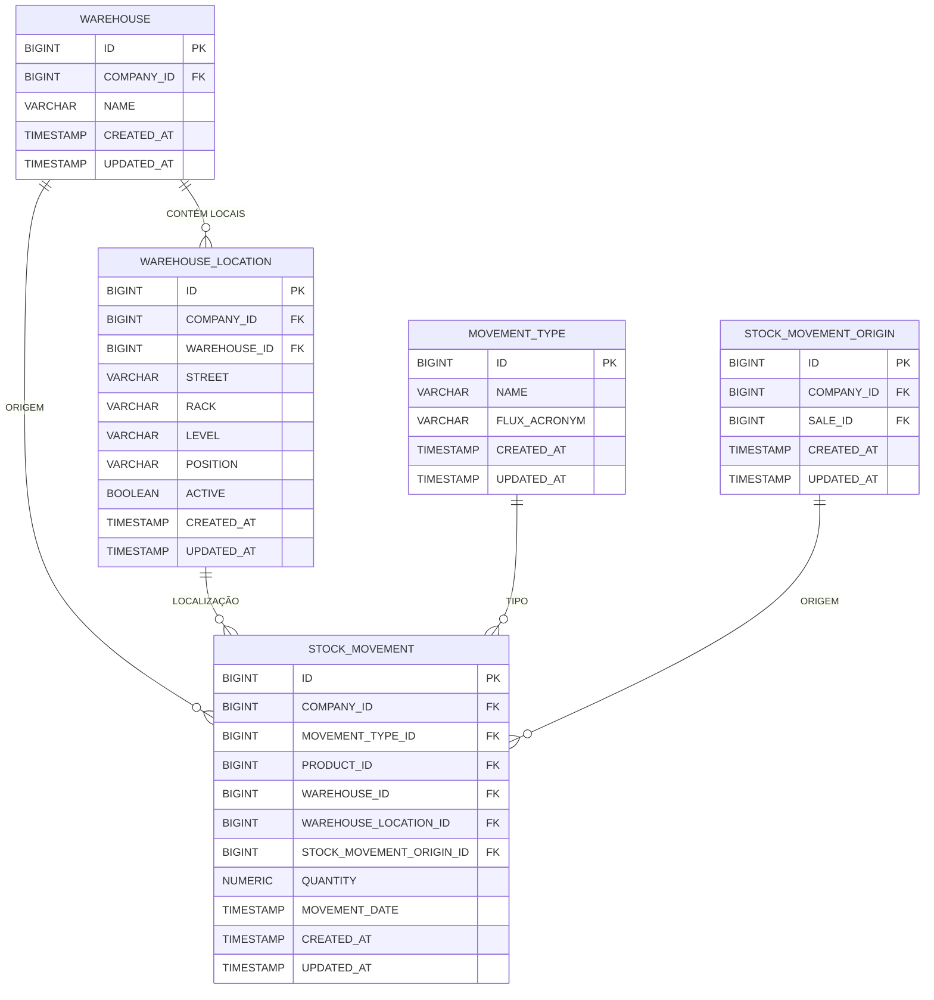

```mermaid-next
erDiagram
WAREHOUSE {
        BIGINT ID PK
        BIGINT COMPANY_ID FK
        VARCHAR NAME
        TIMESTAMP CREATED_AT
        TIMESTAMP UPDATED_AT
    }
    WAREHOUSE_LOCATION {
        BIGINT ID PK
        BIGINT COMPANY_ID FK
        BIGINT WAREHOUSE_ID FK
        VARCHAR STREET
        VARCHAR RACK
        VARCHAR LEVEL
        VARCHAR POSITION
        BOOLEAN ACTIVE
        TIMESTAMP CREATED_AT
        TIMESTAMP UPDATED_AT
    }
    MOVEMENT_TYPE {
        BIGINT ID PK
        VARCHAR NAME
        VARCHAR FLUX_ACRONYM
        TIMESTAMP CREATED_AT
        TIMESTAMP UPDATED_AT
    }
    STOCK_MOVEMENT_ORIGIN {
        BIGINT ID PK
        BIGINT COMPANY_ID FK
        BIGINT SALE_ID FK
        TIMESTAMP CREATED_AT
        TIMESTAMP UPDATED_AT
    }
    STOCK_MOVEMENT {
        BIGINT ID PK
        BIGINT COMPANY_ID FK
        BIGINT MOVEMENT_TYPE_ID FK
        BIGINT PRODUCT_ID FK
        BIGINT WAREHOUSE_ID FK
        BIGINT WAREHOUSE_LOCATION_ID FK
        BIGINT STOCK_MOVEMENT_ORIGIN_ID FK
        NUMERIC QUANTITY
        TIMESTAMP MOVEMENT_DATE
        TIMESTAMP CREATED_AT
        TIMESTAMP UPDATED_AT
    }


    WAREHOUSE ||--O{ WAREHOUSE_LOCATION : "CONTÉM LOCAIS"
    WAREHOUSE ||--O{ STOCK_MOVEMENT : "ORIGEM"
    WAREHOUSE_LOCATION ||--O{ STOCK_MOVEMENT : "LOCALIZAÇÃO"
    MOVEMENT_TYPE ||--O{ STOCK_MOVEMENT : "TIPO"
    STOCK_MOVEMENT_ORIGIN ||--O{ STOCK_MOVEMENT : "ORIGEM"
```